<!-- とりあえずMD+pandocで作る。

pandocからlualatexを呼ぶとデフォルトでは日本語が表示されないのでlualatexに
適当にオプションを渡して変換する。
pandoc *.md -o manual.pdf --pdf-engine=lualatex -V documentclass=bxjsarticle -V classoption=pandoc  --toc-depth=3

htmlへはこんな感じ
 pandoc --standalone -f markdown -c ../index.css -t html readme.md  > index.html

この辺参考
基本的な使い方 

https://www.mimir.yokohama/useful/0017-pandocmarkdown.html

相互参照など（まだ Word で消耗してるの？ 大学のレポートを Markdown で書こう）
https://qiita.com/Kumassy/items/5b6ae6b99df08fb434d9

pandoc MD記法概要
http://www.grkt.com/2013/01/14/1422
 -->

# Abstract
Gxsview is a stand-alone multi-platform integrated tool to visualize
input data of Monte Carlo radiation transport calculation code, MCNP5, and PHITS3.
It consists of 3D, 2D, cross-section, and input file viewers. 
Also, this software is capable of exporting in 2D(png, jpg, and xpm) 
or 3D(stl, vtk, vtp and ply) formats.

# License
[GPLv3](https://www.gnu.org/licenses/gpl-3.0.en.html)

# 1. Installation 
## Hardware requirement

- GPU supporting OpenGL 2.0 or later

While OpenGL 2.0 is not supported, Mesa3D (<https://www.mesa3d.org>) library may work well, but the performance is significantly reduced.

## Software dependencies

- Qt5  (5.15 LTS is recommended)(<https://www.qt.io>), 
- VTK (8.0 or later)  (<https://www.vtk.org>), and
- (for Linux/macOS) fontconfig  (<https://www.freedesktop.org/wiki/Software/fontconfig/>) 

If your system does not have libraries above, you should install them manually. 
**The following VTK modules must be enabled Qt, Viewers, Rendering, Imaging, opengl and all OpenGL2 group modules.** 
Unfortunately, these modules may not be enabled at compile time in VTK libraries supplied by the OS. You can download VTK files with these modules for [Linux](https://www.nmri.go.jp/study/research_organization/risk/gxsview/download/lin64.vtk9.zip), [Windows](https://www.nmri.go.jp/study/research_organization/risk/gxsview/download/win64.vtk9.zip), or [MacoOS](https://www.nmri.go.jp/study/research_organization/risk/gxsview/download/mac64.vtk9.zip) for convenience (**There is no guarantee for these files!**).

## Build
### From command line
1. Prepare a C ++ 17 compiler.
1. Download and extract [src.zip](https://www.nmri.go.jp/study/research_organization/risk/gxsview/download/src_1.3.zip).
1. Change directory to gxsview/gui.
1. Run qmake with specifing variables, *VTK_DIR* and *VTK_MAJOR_VER* , for example,
<pre> qmake   VTK_DIR=/opt/vtk/vtk9.0  VTK_MAJOR_VER=9.0 </pre>

4. Or edit `gui.pro` to set the variables to include header files located in $VTK_DIR/include, then run qmake command, for example, insert two lines below to in the begging of `gui.pro' then run qmake without any arguments:
<pre>VTK_DIR=/opt/vtk/vtk9.0 
VTK_MAJOR_VER=9.0 </pre>

5. Execute make command.

### From qtcreator
Open and edit gui.pro *VTK_DIR* and *VTK_MAJOR_VER* the same as above 4..

## Binary installation
### Windows 
- Download and expand [win64.zip](https://www.nmri.go.jp/study/research_organization/risk/gxsview/download/win64_1.3.zip), and
- Double click win64/gxsview.exe. 

### linux
- Download and expand [lin64.zip](https://www.nmri.go.jp/study/research_organization/risk/gxsview/download/lin64_1.3.zip),
- Launch lin64/gxsview.sh.

### macOS binary (testing)
- Download and expand [mac64.zip](https://www.nmri.go.jp/study/research_organization/risk/gxsview/download/mac64_1.3.zip).
- App files are included under mac64/ folder. You can launch gxsview by double-clicking mac64/gxsview.app in the Finder.

Confirm md5sum [hash](https://www.nmri.go.jp/study/research_organization/risk/gxsview/download/md5sum.txt).

### Command line options
- `--`css=(*theme name*)  Set initial theme. "darkstyle" or "darkorange". [none]
- `--`no-xs Do not read corss section files [not set]
- `--`thread=(*number of thread*) Set number of threads [number of cpus]
- `--`verbose  Enable verbose output [not set]
- `--`xsdir=(*file path to the xsdir file*)Use user specified xsdir file [ not set]

If you use the darkorange theme with multithreading, with verbose output, and with your custom xsdir file placed in /opt directory, use options below (input.mcn is the MCNP input file).
>  gxsview input.mcn `--`css=darkorange `--`thread=3 `--`verbose `--`xsdir=/opt/my_xsdir

In case, --xsdir is not specified, the xsdir file path is resolved by the same manner as the MCNP code.

# 2. Overview
## GUI window
Mainwindow consists of the menu, tab, views log, and status bar.  

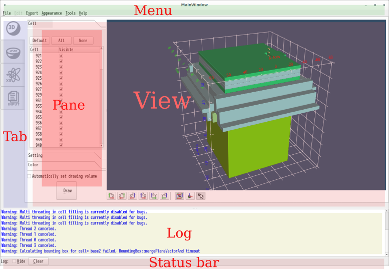{#fig:mainwindow}

Four viewers are integrated into the view and can be switched by the tab widget. Each viewer has some pane(s) for configuration.

## 3D geometry view
In this view, 3D polygonized geometry can be drawn. There exist three panes for cell selection, configuration, and color setting respectively. 
Cells selected by the cell pane are displayed after pushing the "Draw" button.

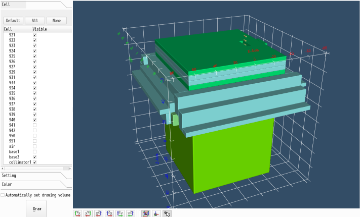{#fig:3dview}

## 2D geometry view
Sectional images can be drawn in the 2D geometry view.
In this viewer, a command-line interface is adopted. 
Users can input a command (or multiple, semicolon-separated commands) in the line edit widget and press the applying button.
Most of the plotting commands are compatible with those of the MCNP 2D plotter.

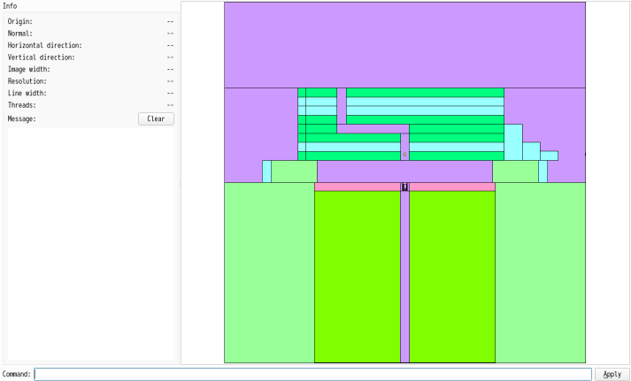{#fig:2dview}

## Cross section view
The cross-section viewer displays cross-section data described in the ACE (A Compact ENDF) format used in the input file. Neutron cross-section data, photo-atomic data, and dosimetry data are acceptable. 

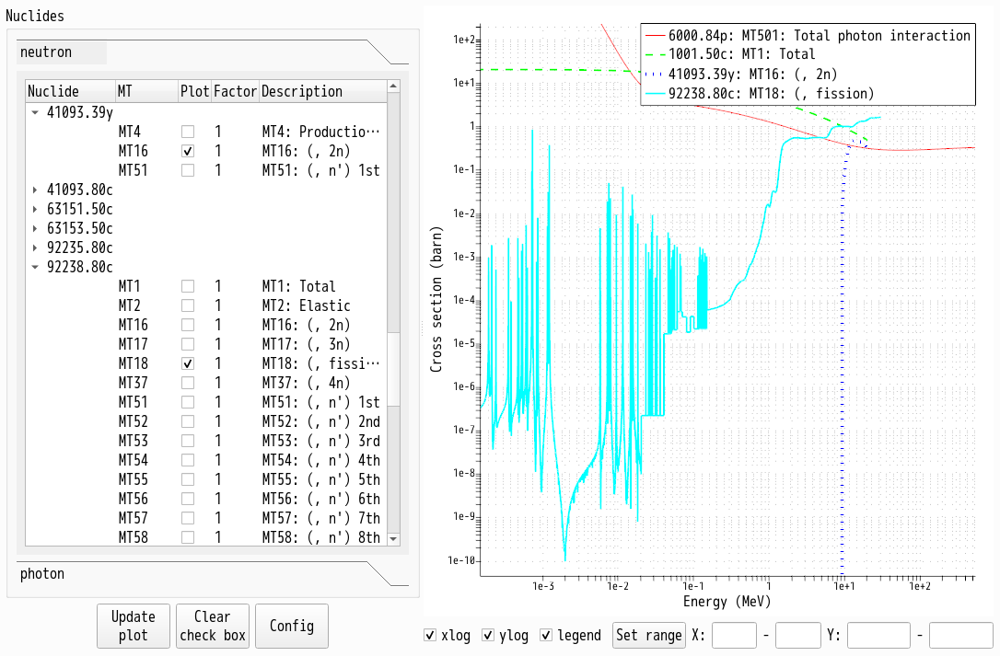{#fig:xsview}

## Input file view
The input viewer is a simplified three-pane text editor. If the root file includes other files, the file tree is displayed in the upper-left pane. 
The lower-left pane shows currently opened files, and the user can edit input files in the right pane. The editor provides a syntax highlighter for MCNP or PHITS and a search-and-replace function. 
If a fatal error occurs during input file reading, the viewer highlights the line if possible.

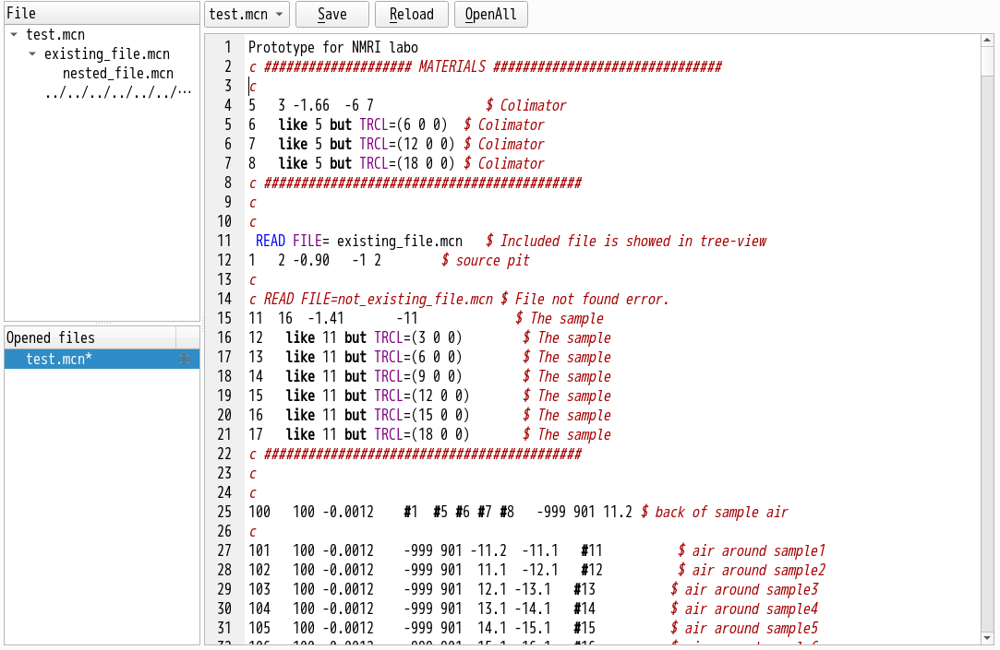{#fig:inputview}

# 3. Tutorial
There are MCNP examples in the "examples" directory in the source archive or in the example.zip file available [here](https://www.nmri.go.jp/study/research_organization/risk/gxsview/download/examples.zip). 
"examples/nmrilabo" describes the source pit, collimator, and detector models used in National Maritime Research Institute (NMRI).

## Launch and load input file
Please specify an input file as an argument, or specify an input file from the "File" menu after startup. The user interface language is selected depending on the system locale. 
UI (language, theme, and font size) can be modified by the "Appearance" menu.

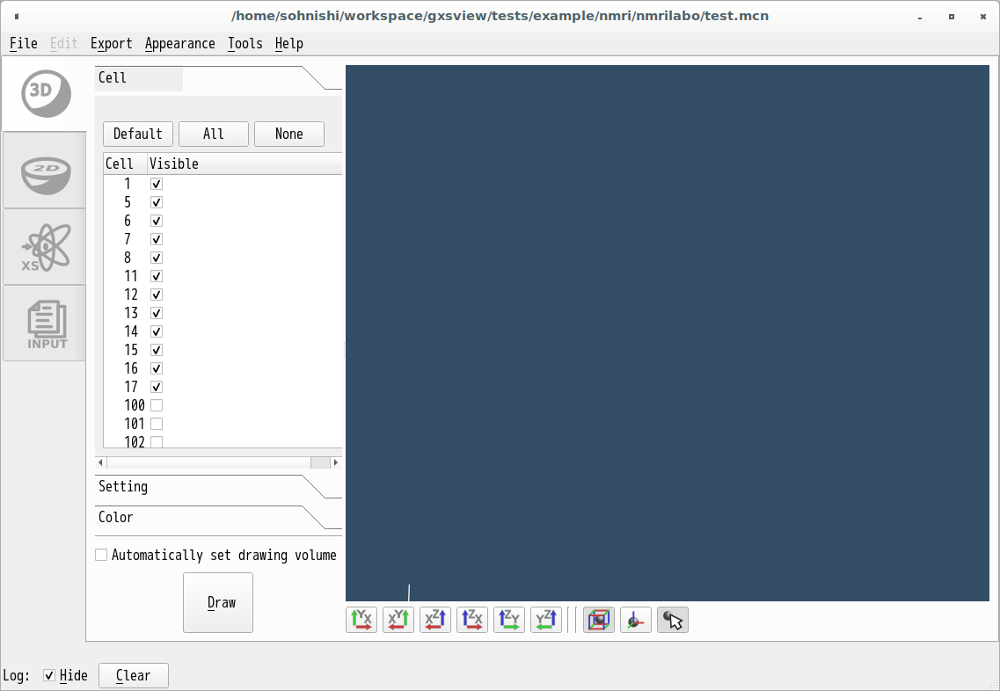{#fig:nmrilabo1}

## Display geometry in 3D
You can choose the cells to display in the cell pane. 
Cells of which their importance > 1 and density > 0.0012 g/cc are default selected. 

The "Draw" button starts polygon construction and drawing.
If "Automatically set drawing volume" is checked, the drawing ranges are determined by cells' bounding boxes. 
If not, you should set manually in the setting pane (or use default values [&plusmn;50, &plusmn;50, &plusmn;50] ).
In this example, all the bounding box are calculated precisely,
 and this checking box works well.

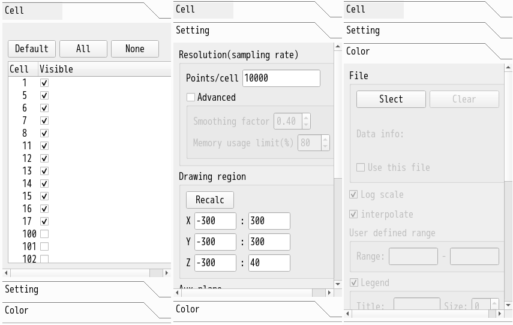{#fig:panesnmrilabo1}

The model includes a concrete floor (cell 901) and a soil layer (cell 902), and they are not needed to be displayed.
You can get appropriate instrument models by removing checks of cells 901 and 902 in the cellpane, adding a check to "Automatically set...", then pushing the "Draw" button.

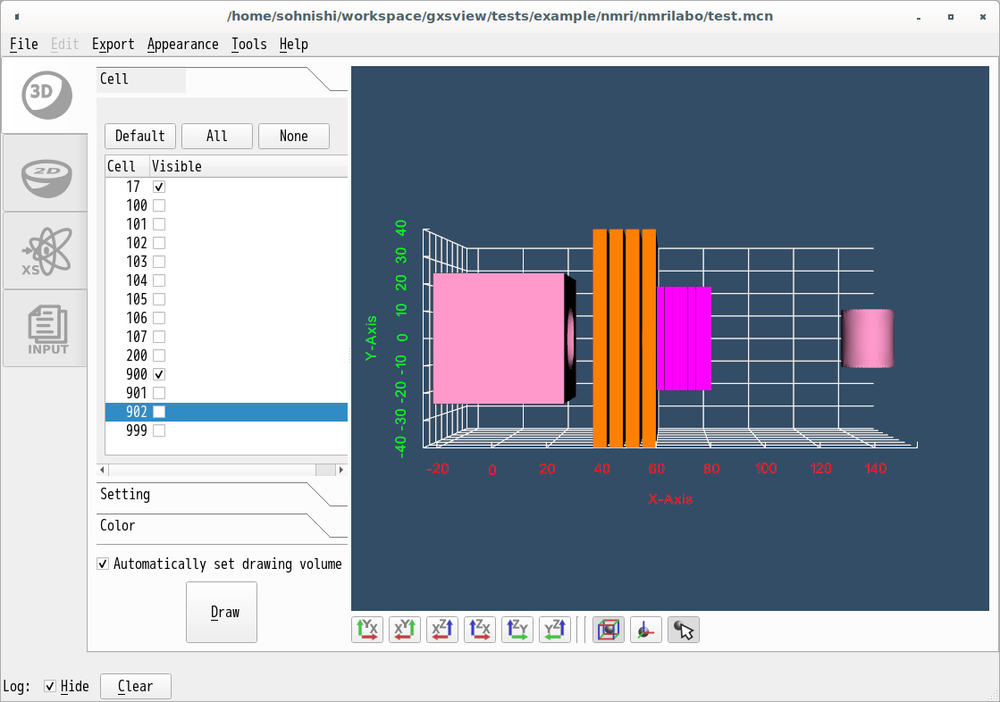{#fig:nmrilabo4}

Source pit (cell 1), collimators (5-8), concrete plates (11-17), and rem counter (900) are shown.
The polygons can be rotated (left button drag), panned (center button drag), zoomed (right button vertical drag or wheel), picked (left button), and hidden (right button) with your mouse.

## Cut by planes

In the setting pane, the sampling rate during polygon construction,
drawing ranges, and cutting planes are configured.
By checking the "Z" checkbox, input plane location along the z-axis, and selecting cutting sides(plus, minus, or not cut) in the "Aux plane" group, you can cut the polygon model by the z-plane.
Please do not forget to push the "Draw" button again.

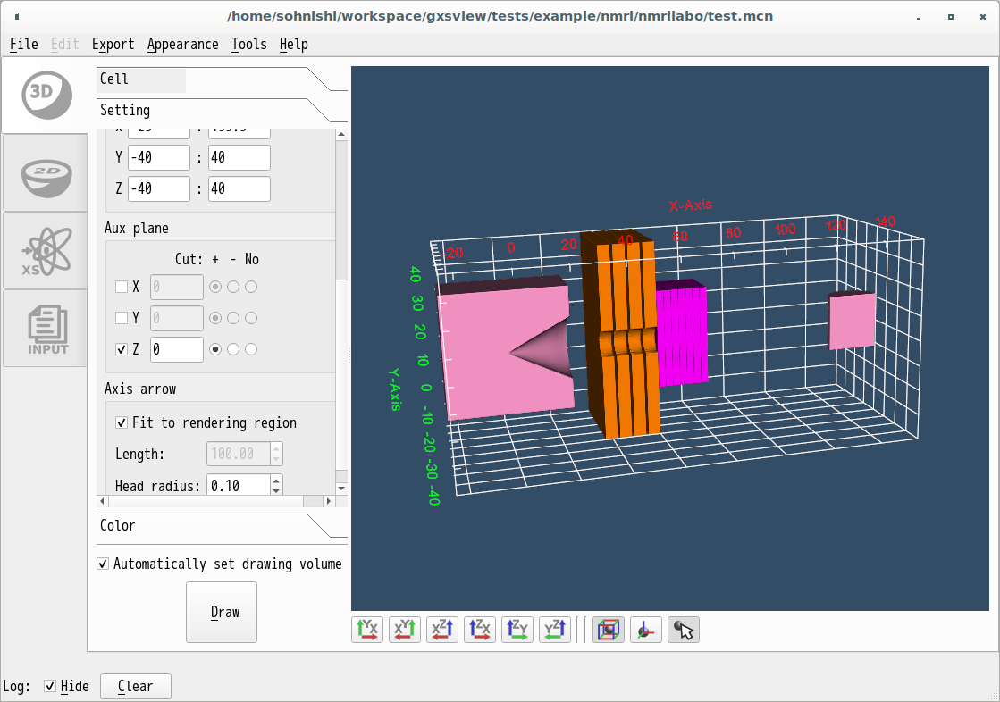{#fig:nmrilabo5}

## Change color by scalar field values (Experimental)
In the color pane, MCNP rectangle mesh tally results can be read and set the cell surface color by the scalar values.
Push the "Select" button in the color pane and choose "sample.meshtal".
To eliminate the ZERO value, 1E-30 are used in the "sample.meshtal".
Setting an appropriate lower limit may improve the plot with a logarithmic scale.
Please do not forget to push the "Draw" button again.

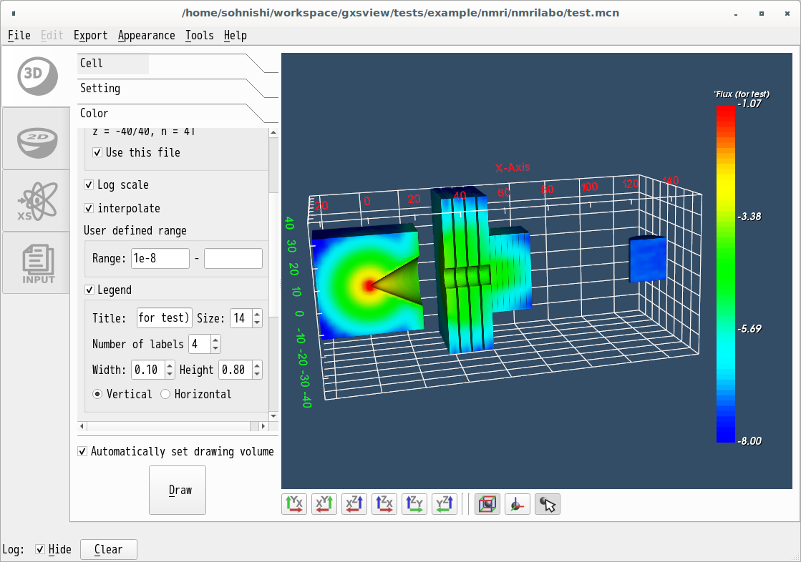{#fig:nmrilabo6}

## Export
The "Export" menu does export what is currently displayed in the view, for example, polygons in the 3D view.
Therefore, cells you don't want to visualize should be hidden (unchecking in the cell pane and redrawing).
After selecting format, ex. "Export" -> "3D graphics" -> "stl", scaling-factor-selection subdialog will appear.
The length unit used in MCNP is "cm" but many applications adopt "mm".
So 0.1 is appropriate in most cases. In this sub dialog, you can select whether to unify all the cells before exporting or creating files for each cell.

## Display geometry in 2D
Click the 2D icon on the tab on the left to switch to the 2D viewer. This viewer uses CUI, and the drawing command is executed by entering a command in the "Command" field at the bottom of the window and pressing the "Apply" button.
The supported commands are:

| Command  | Arguments         | Operation|
|--        |    --             |--|
|h\|help   |                   |   Show help.|
|conf      |                   | Show current configuration.|
|ex        | xwid ywid | Set the plotting range as xwid and ywid.|
|o\|origin |x y z | Set the origin to (x,y,z).|
|r\|resolution | v \[h=v\] | Set horizontal and vertical resolutions (h, v) in pixels. The second argument is optional, and if omitted set the same value as the first one.|
|fit       |                   | Adjust resolution to fit current window size.|
|t         |  n         |  Set number of threads (n<256) used in plot sections.|
|lw | n   | Set line width. | 
|px | vx | Plot plane perpendicular to x axis at vx.|
|py | vy | Plot plane perpendicular to y axis at vy.|
|pz | vz | Plot plane perpendicular to z axis at vz.|
|p  | x1 y1 z1 x2 y2 z2 | Plot plane with vertical vector(x1, y1, z1) and horizontal vector(x2, y2, z2).|

Two or more commands can be entered by separating them with a semicolon (;).
The figure below shows the result of 
<pre>o 60 0 0; py 0</pre>
command.

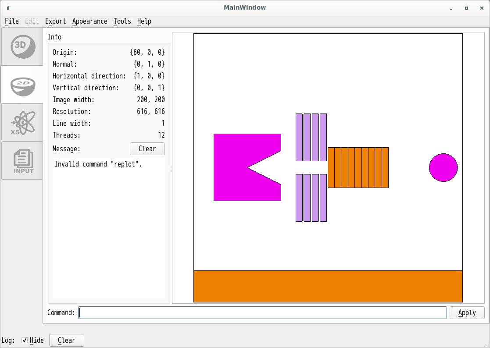{#fig:nmrilabo7}

# Known issues
- Functions about memory usage do not work correctly on macOS.

# Acknowledgement

This software is using

- Qt5 (<https://www.qt.io>), 
- VTK8 or VTK9 (<https://www.vtk.org>), 
- fontconfig (<https://www.freedesktop.org/wiki/Software/fontconfig>), and
- picojson (<https://github.com/kazuho/picojson>)

In detail, see "Help" -> "License" menu.
"# SOFTX_2020_46" 
